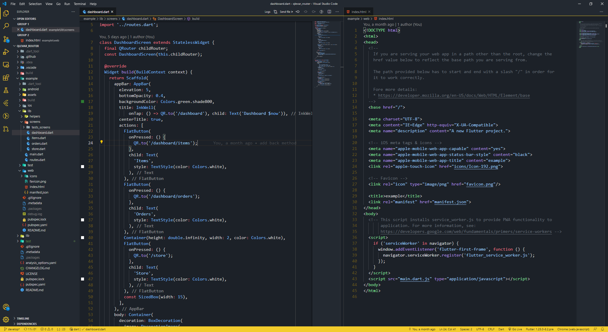

# Qlevar Theme

Visual Studio Code Theme

## Install

- Download `qlevar-theme-0.0.1.vsix` File
- Go to vs code
- Go to Extensions
- Go to View more Actions (Three points)
- Go to install from VSIX
- Pick the downloaded file
